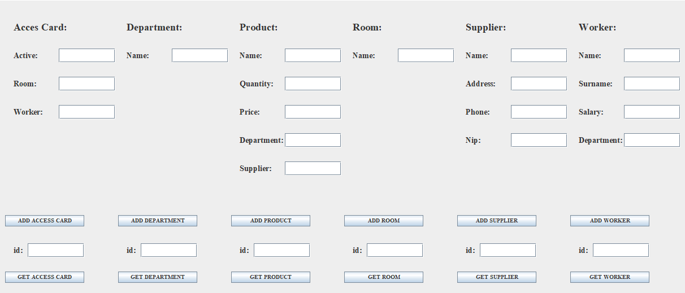

# Shop Database (+ graphical user interface)
## Built With

* [Maven](https://maven.apache.org/) - Dependency Management

* [Hibernate](http://hibernate.org/) - ORM framework

* [MySQL](https://www.mysql.com/) -  Database management system

* [Swing](https://docs.oracle.com/javase/8/docs/technotes/guides/swing/) -  GUI widget toolkit for Java

* [JUnit 5](https://junit.org/junit5/) - Unit testing framework

## GUI example

